# ZonicMe Creative Commerce Dossier

**MyAfriart & MyYanga — Business Plan, Monetization, Market Projections, Launch Strategy, Risk and IP**

Prepared July 2026 · ZonicMe Limited · Abuja · Lagos · Diaspora · Confidential

This dossier covers ZonicMe's two creative-commerce platforms in two distinct sections:

- **Section A — MyAfriart**: the African art marketplace, auction house, private-sale floor and art-collateral registry.
- **Section B — MyYanga**: the African fashion portal with AI virtual try-on, smart search, competitions and creator patronage.

Each section presents the monetization plan with market projections, a proposed digital launch strategy, benchmarks against comparable targeted platforms, an examination of shopping risks and the mitigations already engineered into the build, a schematic of the notification-reel monetization flow (broken out as distinct revenue lines, including sponsored giveaway and discount-code mechanics), and an intellectual-property protection review. In-application screenshots are embedded throughout so the reader can judge the UI/UX directly from this document.

**A note on projections.** All revenue projections in this dossier are planning scenarios, not forecasts. Assumptions are stated beside every table so they can be challenged and re-run. Naira figures use an indicative rate of NGN 1,600 = USD 1.

---

# SECTION A — MYAFRIART

## A1. What the Platform Is

MyAfriart is a full-stack marketplace and services platform for African art: a curated catalogue with Buy Now checkout, a timed auction house run to international standards (reserves, bid increments, 20% buyer's premium, anti-sniping soft close), a members-only private-sale floor ("the Sale Lounge") with escrow and brokerage, a certification and public-verification registry, a provenance ledger, and an art-backed collateral registry — all wrapped in trust infrastructure (KYC, escrow, disputes, signed webhooks) that regional competitors do not have.

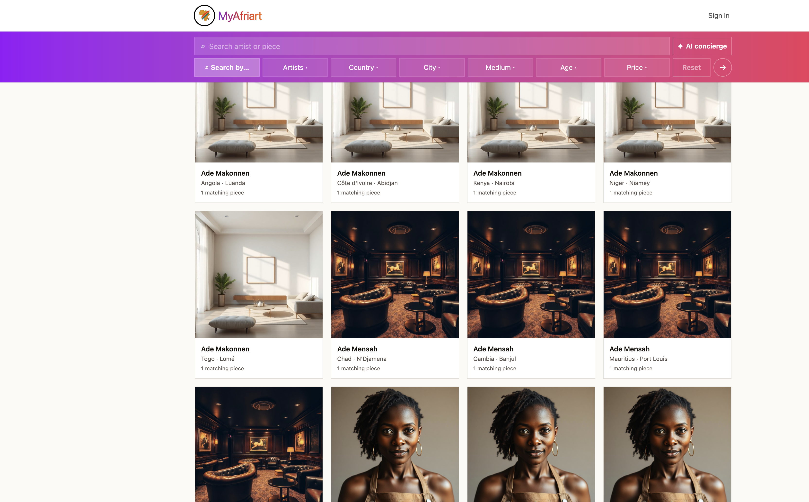

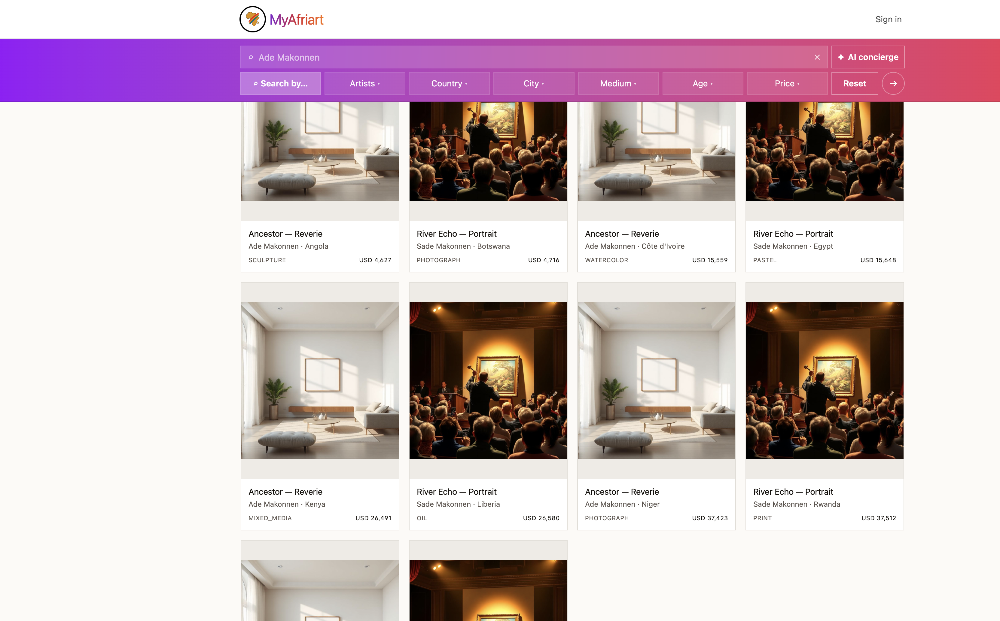

The trust layer is the moat. Anyone can list art online; very few platforms can make a stranger-to-stranger NGN 5m art transaction feel safe. Escrow, identity verification, certificates with public verification codes, and an immutable provenance ledger are what convert browsers into transactors at serious price points.

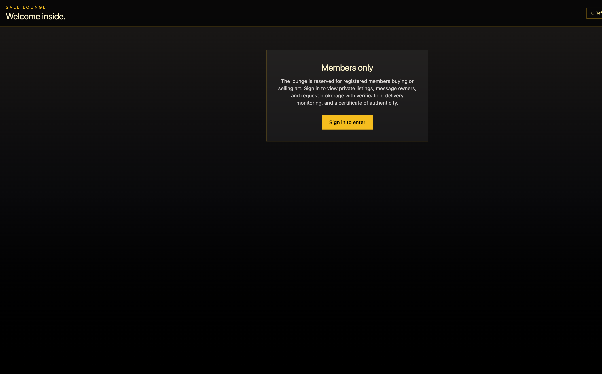

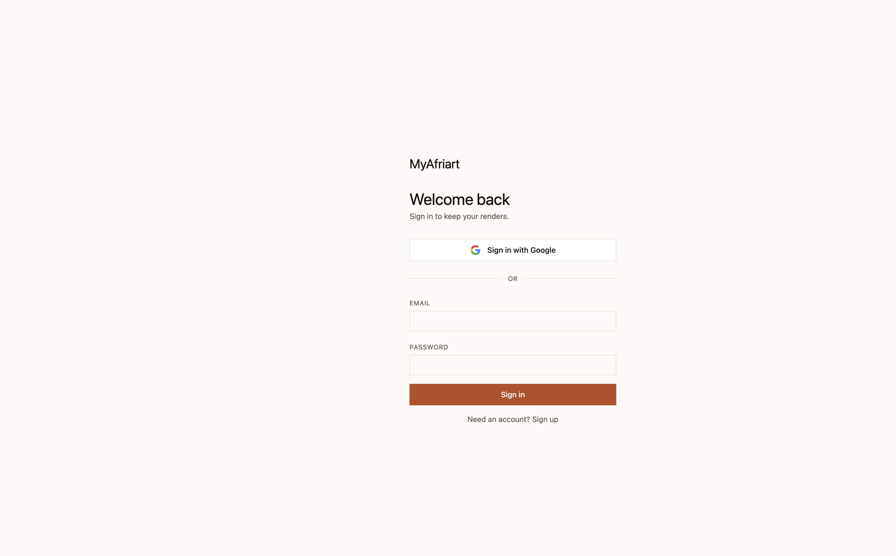

## A2. Market Context & Projections

### The market MyAfriart sells into

| Indicator | Value | Source |
|---|---|---|
| Global art market (2025) | $59.6bn, +4% year on year | Art Basel / UBS Art Market Report 2026 |
| Online art sales (2025) | $9.2bn (15% of the market) | Art Basel / UBS 2026 |
| Global public auction sales (2025) | $20.7bn, +9% | Art Basel / UBS 2026 |
| Dedicated African art sales, major houses | $100m+ cumulative since 2017 | MoMAA African & Diaspora Outlook 2026 |
| African-born artist auction record | $10.7m (Julie Mehretu) | MoMAA 2026 |
| Online auction sweet spot | 63% of online auction value sits below $50,000 per lot | Art Basel / UBS 2026 |

Three structural observations drive the opportunity:

- **The online segment is exactly MyAfriart's price band.** Online auction value concentrates in the $5,000–$50,000 range — the natural territory for contemporary African works — while trophy lots stay in live rooms. MyAfriart is not competing with Christie's evening sales; it is digitising the band the big houses serve worst.
- **African art is under-infrastructured, not under-demanded.** Dedicated African sales at Sotheby's, Christie's and Bonhams have cleared $100m+ since 2017 with strong sell-through, yet the continent itself has no platform combining auction, escrow, certification and provenance. Consignors currently ship to London to reach trust infrastructure. MyAfriart brings the infrastructure to the work.
- **Provenance compounds.** Every MyAfriart sale writes a provenance event; certified works resell at a premium *because* they were sold through the platform. This is a flywheel competitors cannot copy quickly, because it accrues with transaction history.

### Comparable platform benchmarks

| Platform | Model | What they achieved | Lesson for MyAfriart |
|---|---|---|---|
| Artsy | Global online marketplace + auctions | The category reference for online discovery-to-bid; strongest in the sub-$50k band | Validates the online mid-market thesis; weak African coverage leaves the niche open |
| Saatchi Art | Direct-from-artist marketplace | Scaled a commission model on emerging artists globally | Commission-only economics work at volume, but with no trust layer the average order stays low |
| Sotheby's / Christie's African depts | Dedicated African sales | $100m+ cumulative since 2017; record prices for African-born artists | Demand is proven at the top; the consignment pipeline from Africa is the bottleneck MyAfriart owns |
| Sotheby's Financial / Athena Art Finance | Art-secured lending | Multi-billion-dollar global category | Effectively non-existent for African art — MyAfriart's collateral registry is a first mover |

### Revenue lines and three-year projection (base case)

Notification reels are broken out as their own distinct lines, per the monetization plan.

| Revenue line | Mechanics | Y1 (NGN) | Y2 (NGN) | Y3 (NGN) |
|---|---|---|---|---|
| Buyer's premium | 20% on every auction hammer | 14m | 70m | 220m |
| Direct-sale margin | Platform-set margin/commission on Buy Now | 10m | 48m | 150m |
| Lounge brokerage | 5% (tunable) on brokered private sales | 6m | 35m | 120m |
| Certification services | Authentication + certificate + delivery monitoring | 3m | 12m | 35m |
| Collateral registry fees | Authentication and registry fees on pledged works | 2m | 10m | 40m |
| **Reel: brand placements** | Sponsored panes in curated reels, impression-metered | 8m | 40m | 130m |
| **Reel: sponsored offers** | Discount-code and giveaway panes (premium pricing) | 3m | 18m | 60m |
| **Total** | | **46m (~$29k)** | **233m (~$146k)** | **755m (~$472k)** |

**Assumptions:** Y1 auction GMV NGN 70m (approx. 60 sold lots at NGN 1.2m average hammer), direct-sale GMV NGN 65m at ~15% blended margin, 25 brokered Lounge deals at NGN 4.8m average, growing roughly 4–5x in Y2 as the consignment pipeline and diaspora buyer base build, then ~3x in Y3. Reel revenue assumes 4 sponsor slots/month at NGN 160k average in Y1 scaling with audience. The upside case — an anchor estate consignment or a bank partnership on collateral lending — is materially above these lines and is deliberately excluded.

## A3. Digital Launch Strategy

**Positioning:** *The only platform where African art can be discovered, staged on your wall, bought, auctioned, brokered, certified, verified, and borrowed against.*

### Phase 0 — Pre-launch (weeks 1–6)

- Seed the catalogue: 150–250 authenticated works from 30–50 artists and 2–3 estates; every piece photographed and provenance-documented. Quality over volume — the first auction must feel like a real sale.
- Founding-consignor programme: waive seller commission for the first 90 days in exchange for exclusivity and stories ("the founding fifty").
- Private beta with 100 invited collectors (Lagos, Abuja, Accra, Nairobi, London, New York diaspora). KYC-verify them ahead of launch so the Lounge is liquid on day one.

### Phase 1 — Launch (weeks 7–12)

- **Anchor event:** one flagship timed auction ("First Sale") with 40 lots, promoted for three weeks. Auctions create a date, urgency and press interest that a marketplace opening cannot.
- **Staging as the shareable hook:** every artwork page pushes "stage this on your wall" — each render a collector shares is an advert with the artwork in it. Room-staging renders are the organic loop.
- **Channels:** Instagram and TikTok art/interiors creators (10–15 micro-influencers, gifted staging sessions), art-press PR (the collateral registry and provenance ledger are genuine stories), targeted Meta ads to diaspora collectors in UK/US (the ANKA pattern: 40% Europe, 30% US buyers), WhatsApp broadcast lists for lot alerts.
- **Certification as marketing:** publicise the public verify URL. "Check any MyAfriart certificate yourself" is a trust claim competitors cannot make.

### Phase 2 — Compounding (months 4–12)

- Monthly themed auctions (photography, women artists, Francophone West Africa) to build a calendar habit.
- Notification reels go commercial: sell sponsor panes to galleries, framers, insurers and art-fair organisers once weekly reel opens pass ~5,000.
- Collateral registry pilot with one lending partner; even 10 pledges creates a press-worthy first for African art.
- KPI gates: 60%+ auction sell-through, 25%+ reel open rate, 10+ Lounge brokerage requests/month, CAC below 15% of first-transaction revenue.

## A4. Shopping Risk & Mitigation (as currently designed)

| Risk | Mitigation in place | Residual exposure |
|---|---|---|
| Buyer pays, work never ships | Escrow: funds held by platform, released by admin only on confirmed delivery; disputes freeze escrow instantly | Admin release discipline; formalise a delivery-evidence checklist |
| Fake or spoofed payment confirmations | HMAC-SHA512 signed webhooks + idempotent event log + dual verification (redirect and webhook); payment is atomic — recorded fully or not at all | Low |
| Forged certificates | Server-registered verify codes, public check at /verify/cert/{code}, revocable | Low — the fraud moves off-platform where it cannot borrow the brand |
| Stolen or double-pledged art | Lien registry: pledged works are flagged and cannot be sold or re-pledged; KYC hard-gate on all pledging | Physical-world verification depends on the authentication workflow's rigour |
| Money laundering / regulatory | Risk-based KYC (always for collateral; escrow at NGN 500k+), full audit trail, attributable admin actions | SCUML registration is an open business action; do it before scale |
| Chargebacks and buyer conflict | In-app dispute filing, escrow freeze, atomic refund resolution, defence-file audit trail | Card-network chargebacks outside escrow flows remain possible |
| Damage or loss in transit | Brokerage pipeline includes delivery monitoring | **Gap: no insurance partnership yet** — negotiate a carrier/underwriter before high-value volume |
| Platform abuse / scraping | Rate limiting (120 req/min/IP), RLS on every table, malware-scanned uploads | Low |

The honest summary: for on-platform escrowed transactions the design is strong — the two open items are commercial, not engineering (transit insurance, SCUML registration).

## A5. Notification Reels — Flow Schematic & Monetization

Reels are MyAfriart's owned re-engagement channel and sellable ad inventory: curated artwork reels matched to member tastes, frequency-capped, with weighted sponsor panes.

```
                        NOTIFICATION REEL PIPELINE — MYAFRIART

  [Admin: Reel Config]        [Curation Engine]              [Assembly]
  frequency cap /wk    --->   member taste profile    --->   N artwork panes
  images per reel             + new drops                    + K sponsor panes
  sponsor slot count          + auction lots closing         (weighted rotation,
  audience selector           + staged-render history         impression quota)
        |                                                          |
        v                                                          v
  [Sponsor Inventory]                                     [Delivery Channels]
  standard pane                                           email / WhatsApp /
  discount-code pane   ------- billing & quotas ------->  web push / in-app
  giveaway pane                (purchased vs delivered)   inbox (/notify)
                                                                   |
                                                                   v
  [Measurement Loop]                                      [Member Engagement]
  impressions delivered  <---- open / click / claim ----  view piece -> stage it
  open & click rates                                      -> bid / buy
  code redemptions at checkout                            claim code / enter
  giveaway entries -> winner draw                         giveaway -> share
```

**Pane types and pricing logic (distinct sub-lines):**

| Pane type | Sponsor pays for | Why sponsors buy it |
|---|---|---|
| Standard brand pane | Metered impressions in a high-intent, art-only audience | Reach without social-platform noise |
| Discount-code pane | Impressions + unique codes; redemptions tracked at checkout | Hard attribution — they see exactly what the placement sold |
| Giveaway pane | Impressions + entry mechanics; platform runs the draw | Deepest engagement: entries, follows, shares and first-party data |

Giveaway and discount panes are deliberately priced above standard panes: they convert the reel from an ad into a participation loop. A member who claims a framing-house discount or enters a staging-session giveaway has taken an action a banner never gets — and every redemption is proof-of-performance that renews the sponsor contract.

**Frequency caps protect the asset.** The reel stays valuable precisely because it is not spammed; scarcity of slots is also what holds the price floor.

## A6. Intellectual Property Protection

| IP asset | Instrument | Action |
|---|---|---|
| Source code, schema, scripts | **Copyright** (automatic on creation) | Register with the Nigerian Copyright Commission for evidentiary weight; US Copyright Office registration enables statutory damages for US enforcement |
| "MyAfriart", "ArtStage" names + logos | **Trademark** | File at the Nigerian Trademarks Registry (classes 9, 35, 36, 41, 42 — software, marketplace, financial services, culture, SaaS); extend via Madrid Protocol to UK/US/EU where the diaspora buyers are |
| Certificate of Authenticity design + verify system branding | **Trademark / trade dress** | Register the certificate mark; the public-verify URL pattern becomes brand infrastructure |
| Provenance ledger data, credibility rankings, price histories | **Database rights / trade secret** | Contractual protection in ToS; access-controlled; do not publish raw |
| Curation and ranking algorithms, valuation heuristics | **Trade secret** | Keep server-side (already the architecture); NDAs for staff and partners |
| Auction rules copy, editorial content, photography | **Copyright** | Platform-owned or licensed under consignment agreements — ensure the consignment contract assigns marketing-image rights |
| Artwork images | **Licensed, not owned** | Consignor agreement must grant display, staging-composite and promotional licence; artists retain their copyright |

**On patents:** software and business methods as such are excluded from patentability in Nigeria (Patents and Designs Act), and equivalent exclusions apply in Europe. The lien-registry workflow and escrow-dispute machinery are unlikely to clear the novelty/inventive-step bar internationally given prior art in fintech. The pragmatic posture: spend the patent budget on trademarks and trade-secret discipline, and consider a **US provisional application** only if the art-collateral registry develops a genuinely novel technical mechanism (e.g., a specific cryptographic provenance-lien binding). A defensive publication of the certificate-verification scheme is a cheap way to prevent a competitor patenting it against you.

---

# SECTION B — MYYANGA

## B1. What the Platform Is

MyYanga is a portal where lovers of African fashion discover, engage and patronize African creatives — designers, photographers, makeup artists and fabric makers. Its flagship is **AI virtual try-on**: the user uploads a photo and the platform generates a photorealistic image of that person wearing selected garments in a chosen scene (wedding, corporate, owambe, evening), with itemised look pricing. Around it: SmartSearch AI with shufflable look decks, editorial spotlights, Post Your Look competitions, events, look sharing with friend comments, a six-gate freemium monetization engine with a three-provider payment cascade, and a full admin operating console with delegated rights management.

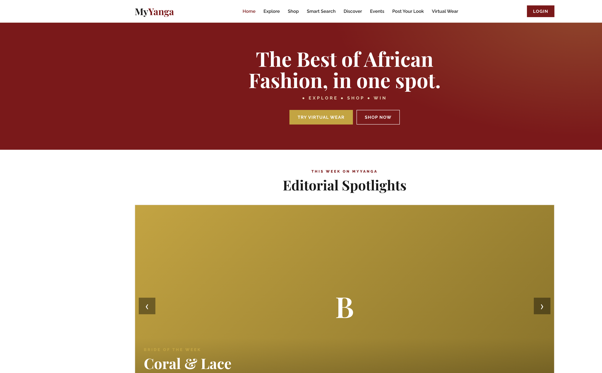

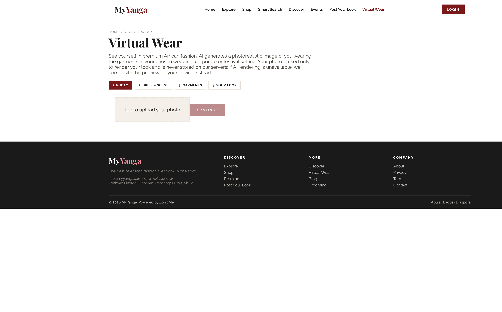

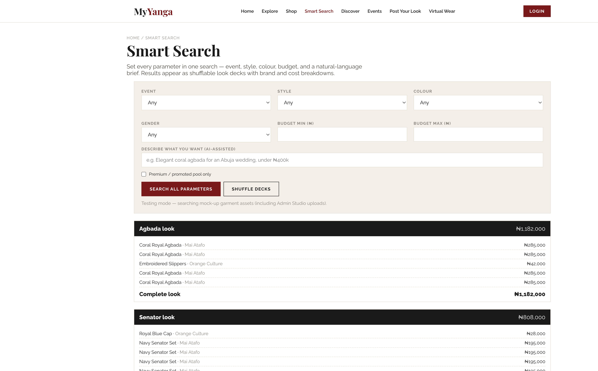

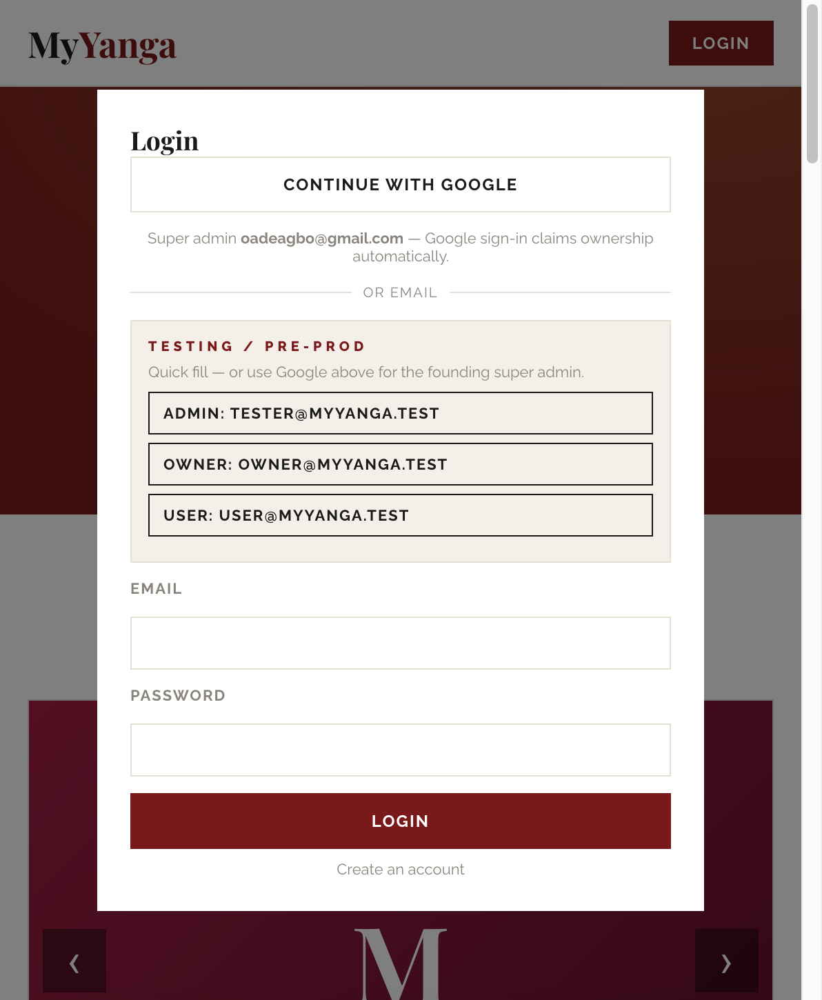

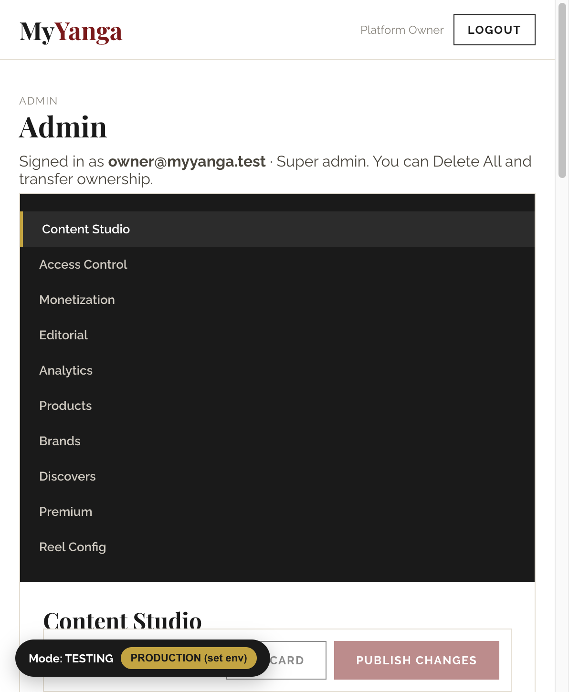

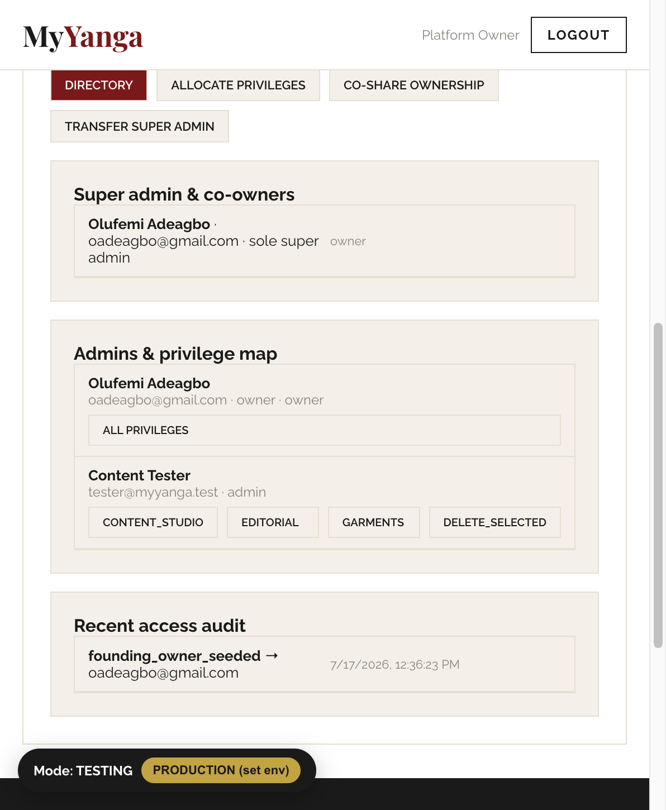

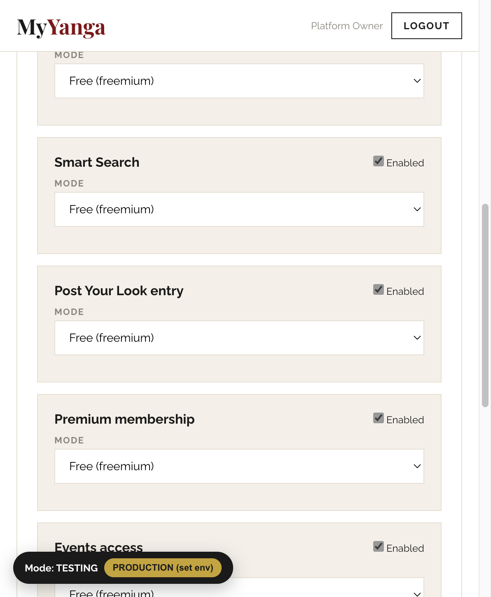

## B2. Market Context & Projections

### The market MyYanga sells into

| Indicator | Value | Source |
|---|---|---|
| African e-commerce users (2025) | 500m+, ~40% penetration, 17% CAGR | USITA / industry analyses 2025–26 |
| African e-commerce market | ~$277bn (2023), ~14% CAGR to 2032 | Industry projections |
| Fashion share of MEA e-commerce | 35% — the largest category | 2025 category data |
| Virtual try-on market | $15.2bn (2025) to a projected $48.1bn (2030, ~26% CAGR) | Grand View Research |
| VTO conversion impact | +20–50% conversion; 3x add-to-cart; 25–40% fewer returns | DRESSX 2026 report; McKinsey; Shopify commerce data |
| Consumer pull | 71% of shoppers want try-on; ~1% of stores offer it | 2025 retail surveys |

The strategic read:

- **Fashion is the biggest category in African e-commerce and try-on is its biggest unsolved problem.** Online apparel returns run 30–40% globally; in African logistics conditions a return is often a written-off sale. A photorealistic try-on before purchase attacks the single largest cost line in the category.
- **The try-on gap is a first-mover window.** 71% of consumers want it and ~1% of stores have it. Nobody has it for African occasion-wear — agbada, aso-oke, senator sets — where fit, drape and occasion-matching are precisely what shoppers agonise over.
- **The diaspora is the beachhead wallet.** ANKA's data shows the pattern: 80% of African fashion orders cross borders, with 40% of buyers in Europe and 30% in the US. MyYanga's virtual try-on travels perfectly — the diaspora buyer cannot walk into the Lagos tailor's shop, but she can see herself in the garment.

### Comparable platform benchmarks

| Platform | Model | What they achieved | Lesson for MyYanga |
|---|---|---|---|
| ANKA (ex-Afrikrea) | African fashion marketplace to SaaS + payments + logistics | $60m+ cumulative GMV, 22,000 sellers in 47 countries shipping to 170; $4.1m revenue (2024); raised $13.5m (incl. IFC); acquired by Global Shop Group, Oct 2025 | The demand and the diaspora corridor are proven; monetizing infrastructure (payments, promotion) outperformed pure marketplace take rates |
| The Folklore | African/diaspora designer platform, pivoted B2B wholesale | $3.4m seed; placed African designers into Nordstrom, Saks, Bergdorf | Consumer-only economics were hard at boutique scale; B2B and services deepen the moat — MyYanga's creator-promotion and reel inventory follow this logic |
| DRESSX / VTO vendors | Try-on technology providers | 1m+ shopper studies: 3x add-to-cart, +50% purchase conversion, 10x conversion in luxury cohorts | Try-on is a conversion machine, not a gimmick — but tech-only vendors lack an audience; MyYanga owns both |
| Drest / styling games | Fashion styling entertainment | Proved engagement economics of styling-as-play | Post Your Look and look sharing borrow the engagement loop and attach commerce to it |

The competitive synthesis: ANKA proved African fashion e-commerce demand but had no experiential layer; DRESSX proved the try-on effect but has no African audience or catalogue; The Folklore proved distribution but not consumer engagement. MyYanga is the only build that combines the audience, the catalogue relationships, and the try-on experience in one place, with monetization rails already live.

### Revenue lines and three-year projection (base case)

Notification reels are shown as **two distinct lines** — standard brand placements and sponsored offers (giveaways / discount codes) — as requested.

| Revenue line | Mechanics | Y1 (NGN) | Y2 (NGN) | Y3 (NGN) |
|---|---|---|---|---|
| Feature access: Virtual Wear + SmartSearch | Per-feature pay gates, admin-priced | 36m | 160m | 480m |
| Premium membership | Subscription gate | 12m | 60m | 200m |
| Post Your Look entries | Paid competition entry | 6m | 25m | 70m |
| Events access | Pay-gated fashion events | 8m | 30m | 90m |
| Creator promotion | Paid placement in the promoted creator pool | 10m | 45m | 140m |
| **Reel: brand placements** | Impression-metered sponsor slots in notification reels | 15m | 80m | 260m |
| **Reel: sponsored offers** | Giveaway + discount-code panes at premium pricing | 5m | 35m | 120m |
| **Total** | | **92m (~$57k)** | **435m (~$272k)** | **1.36bn (~$850k)** |

**Assumptions:** Y1 25,000 registered users growing to 90,000 (Y2) and 250,000 (Y3); ~6% of monthly actives paying at least one gate at a blended NGN 2,000/month; creator promotion at 80 promoted creators (Y1) averaging NGN 10k/month; reel inventory of 6 brand slots/month at NGN 200k average in Y1, scaling with verified reach and redemption data. Not included (upside): commission on garment transactions once the retail checkout journey ships, B2B API licensing of try-on to designer webshops, and white-label reels for fashion brands.

**Why reels are a big monetizer.** Every other line requires the *member* to pay; reels are paid by *brands*, so they scale with audience rather than wallet. The impression-metering already built (purchased vs delivered, visible in the Reel Config studio) is what lets MyYanga sell this credibly from month one — and the giveaway/discount mechanics below turn each reel into an engagement event brands come back for.

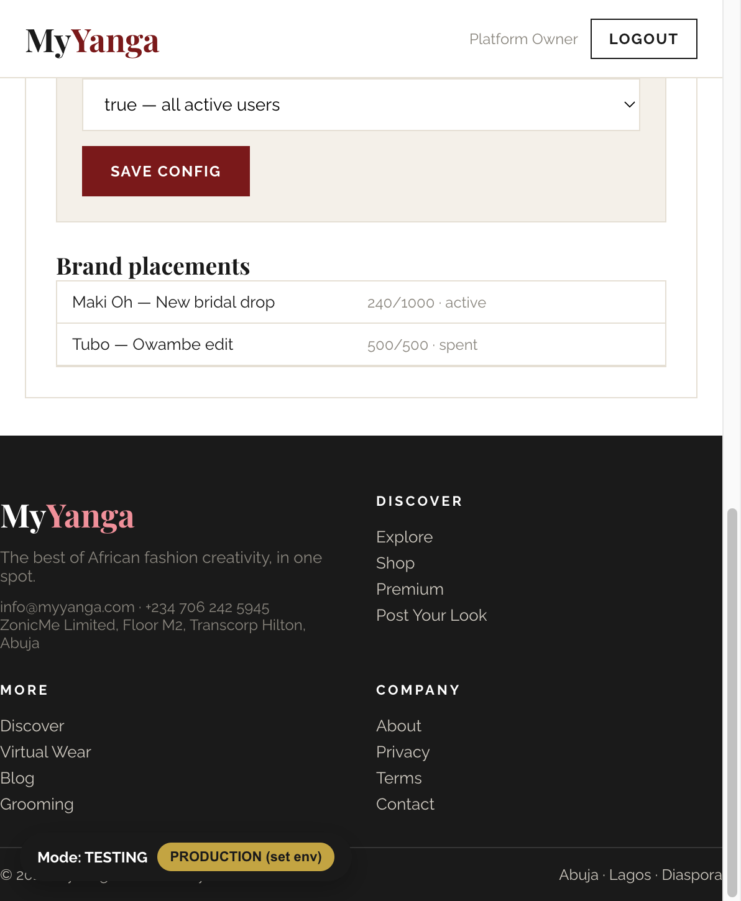

## B3. Digital Launch Strategy

**Positioning:** *See yourself in it before you buy it. The best of African fashion, in one spot.*

### Phase 0 — Pre-production testing (now; weeks 1–4)

- The build's Testing mode is the launch tool: every tester sign-up receives full Admin Studio rights automatically, so designers, stylists and content partners load real garments, publish editorial and exercise every flow with zero infrastructure. These rights revoke automatically at the Production switch.
- Recruit a 30-person tester cohort: 10 designers (garment uploads), 5 stylists/MUAs, 15 target users. Their uploads become the production seed catalogue.
- Photograph the hero garments properly — try-on quality tracks garment photography quality, and this is the single highest-leverage pre-launch task.

### Phase 1 — Launch (weeks 5–12): "The Owambe Engine"

- **Time the launch to wedding season.** Occasion-wear is event-driven; the wedding/owambe calendar is MyYanga's Black Friday. The launch campaign is one repeated act: *upload your photo, see yourself in the outfit, share it to your aso-ebi group chat.*
- **The share loop is the growth engine.** Every generated look carries a public share page (`/look/{code}`) where friends comment without an account. The try-on output is inherently viral — it is a picture of the user looking excellent. Instrument shares-per-look as the north-star metric.
- **Channels:** Instagram/TikTok fashion creators seeded with free Premium and try-on sessions (15–20 micro-influencers in Lagos/Abuja/Accra + 10 diaspora creators in London/Houston/Toronto); Meta ads targeted on engagement + diaspora corridors; WhatsApp status content packs for designers ("your garment, on your customer, before she buys"); PR on the AI try-on first for African occasion-wear.
- **Competitions bootstrap content:** Post Your Look runs free for the first 60 days; the votes gallery is the community flywheel. Introduce the entry fee only after weekly entries exceed ~200.
- **Creator side:** onboard 100 creatives with free profiles; sell promotion slots only after the discover surface has organic traffic (sell results, not promises).

### Phase 2 — Compounding (months 4–12)

- Flip Virtual Wear and SmartSearch to paid tiers once weekly try-on volume passes ~2,500 renders (free tier: low-resolution or 3 renders/month; paid: unlimited + premium scenes).
- Launch reel brand placements once the notification audience passes ~10,000 opted-in members; lead with giveaway panes (they self-promote) and use redemption dashboards to close renewals.
- Ship the retail checkout journey (the current stub) and take commission on garment sales — the largest unmodelled line.
- KPI gates: 25%+ of new users complete a try-on in week one; 1.5+ shares per generated look; D30 retention 20%+; reel open rate 30%+; CAC under NGN 1,200 blended.

## B4. Shopping Risk & Mitigation (as currently designed)

MyYanga's commerce model is two-lane: **feature payments** (gates, memberships, entries — fully on-platform) and **garment patronage** (currently engage-and-patronize via the creator's WhatsApp/Instagram/shop, with on-platform retail checkout stubbed for a later phase). The risk profile differs per lane and the honest assessment below covers both.

| Risk | Mitigation in place | Residual exposure |
|---|---|---|
| Paying for a gated feature and not receiving access | Payments verified twice (redirect return + provider webhook); entitlements written server-side by `fulfil_payment`; gates re-checked inside edge functions, not just UI | Low |
| Provider outage killing checkout | Three-provider cascade (Flutterwave then Paystack then Stripe) with automatic failover, order admin-configurable | Low |
| Spoofed payment webhooks | Webhook log + server-side verification | **Deepen per-provider signature verification before high volume** — currently basic |
| Client-side tampering to skip paywalls | All gates enforced server-side (`get_feature_gate` RPC inside edge functions); roles/privileges live only in the database in production | Low |
| Buyer pays a creator off-platform and is defrauded | Creator credibility ranking and promoted-pool curation reduce exposure; engagement happens on channels the buyer already trusts (WhatsApp/IG) | **Structural: off-platform transactions carry no platform protection.** Mitigation path: ship on-platform checkout with escrow-style payout holds, following the MyAfriart pattern |
| Garment doesn't look right on arrival | **Virtual try-on is itself the mitigation** — the buyer has seen the garment on their own body before committing; industry data: 25–40% return reduction | Fit/tailoring variance remains; add measurement capture at checkout phase |
| Counterfeit or misrepresented garments | Admin-curated catalogue; garment uploads privilege-gated | Scale will need a creator verification tier (borrow MyAfriart's KYC machinery) |
| User photo privacy | Photo used only to render the look; on-device canvas fallback never uploads; AI path processes transiently and does not persist the source photo; look saving is user-initiated | Publish the retention policy in the privacy page; NDPR (Nigeria Data Protection Act) registration as volumes grow |
| Refunds and disputes | Payments and entitlements are durable, auditable tables | **No in-app dispute flow yet** — port MyAfriart's dispute/refund machinery before scale |
| Testing-rights leakage into production | Testing privileges live only in localStorage; production roles come exclusively from the database; auto-revocation verified in the 42-check aggressive audit | Low |

Summary: the money that flows on-platform today is well-protected; the two build-next items are per-provider webhook signature depth and the dispute flow, and the strategic move is bringing garment transactions on-platform where the trust machinery can protect them.

## B5. Notification Reels — Flow Schematic & Monetization

MyYanga's reels deliver configurable fashion image reels by email, WhatsApp, web push and in-app, with brand ad slots per reel, admin-set frequency, and audience selection (all users vs premium). The Reel Config studio already meters purchased vs delivered impressions — the billing backbone.

```
                        NOTIFICATION REEL PIPELINE — MYYANGA

  [Admin: Reel Config]         [Curation Engine]             [Assembly]
  images per reel       --->   member taste + size     --->  N garment/look panes
  ad slots per reel            + new garment drops           + K brand panes
  send frequency               + editorial spotlights        (weighted rotation,
  audience (all/premium)       + trending PYL looks           impression quota)
        |                                                          |
        v                                                          v
  [Brand Inventory]                                       [Delivery Channels]
  standard pane                                           email / WhatsApp /
  discount-code pane   ------- billing & quotas ------->  web push / in-app
  giveaway pane                (purchased vs delivered)
        |                                                          |
        |                                                          v
  [Measurement Loop]                                      [Member Engagement]
  impressions delivered  <---- open / click / claim ----  view garment
  open & click rates                                      -> TRY IT ON (AI)
  code redemptions at gates/checkout                      -> share the look
  giveaway entries -> winner draw                         claim code / enter
                                                          giveaway
```

**What makes MyYanga's reel uniquely sellable:** the engagement action is not "click through to a product page" — it is *"see yourself wearing it."* A brand pane that launches a try-on of that brand's garment, on the member's own photo, is ad inventory no fashion media owner in the market can offer.

**Sponsored offers — giveaways and discount codes (distinct revenue line):**

- **Discount-code panes:** the brand buys impressions plus unique codes; members claim in one tap; redemptions are tracked at the payment gates (and at garment checkout once live). The brand gets hard attribution; MyYanga prices the pane above standard and takes a per-redemption kicker.
- **Giveaway panes:** the brand funds a giveaway (a garment, a styling session, aso-ebi for two); members enter in-reel; the platform runs the draw and announces winners in the next reel — which lifts the *next* reel's open rate. Entries generate first-party engagement data and brand follows.
- **The incentive logic:** giveaways and codes convert passive recipients into participants. Participation deepens brand engagement, trains members to open reels (protecting open rates, which protects CPM), and produces redemption dashboards that make renewal conversations self-closing.

**Inventory protection:** frequency caps and a fixed ad-slot ratio per reel are already admin-enforced. Scarcity is the price floor; the reel is worth selling only for as long as it stays worth opening.

## B6. Intellectual Property Protection

| IP asset | Instrument | Action |
|---|---|---|
| Source code, schema, edge functions, audit tooling | **Copyright** (automatic) | NCC registration for evidence; US Copyright Office registration for US enforcement reach |
| "MyYanga" name, logo, "The Best of African Fashion, in one spot." | **Trademark** | Nigerian Trademarks Registry classes 9, 35, 38, 41, 42 (software, marketplace/advertising, communications, entertainment/competitions, SaaS); Madrid Protocol extensions to UK/US/EU/Canada diaspora markets |
| Editorial content, campaign imagery, mock garment assets | **Copyright** | Platform-owned; keep creation records |
| Look decks, credibility rankings, trend/search data | **Database / trade secret** | ToS protection; never expose raw ranking signals |
| Try-on orchestration (gate checks, scene prompting, canvas fallback) | **Trade secret + defensive publication** | The generative model is Google's; the orchestration is yours. Keep prompts and pipelines server-side. A defensive publication of the reel-offer redemption loop prevents competitors patenting it against you |
| User-generated looks and PYL entries | **Licence via ToS** | Users retain copyright in their photos; ToS must grant MyYanga a licence to host, render, and display shared looks; competition terms must cover promotional reuse of entries |
| AI-generated try-on renders | **Contract, not copyright** | AI-generated images have uncertain copyright status in most jurisdictions (no human author); govern ownership and permitted use through ToS between platform, member and garment brand rather than relying on copyright |
| Garment images and designs | **Licensed from creators** | Creator agreement must grant catalogue display + try-on compositing rights; the *garment design* itself may qualify for design protection in the creator's name — offering registration help is a creator-retention perk |
| Domains, handles | **Registration hygiene** | Secure myyanga variants (.com/.ng/.africa) and social handles now; they are cheapest before launch publicity |

**On patents:** as with MyAfriart, software and business methods as such are not patentable in Nigeria, and the AI try-on itself rides on a third-party model with heavy prior art (Google, Amazon and a dozen VTO vendors hold the underlying technique patents). Genuine patent spend is unlikely to return value here. The one candidate worth a **US provisional** review by counsel: a specific technical method binding reel impression-metering, per-member unique code issuance and gate-level redemption in one attribution mechanism — if counsel judges it novel. Otherwise: trademarks aggressively, trade secrets rigorously, contracts everywhere, and defensive publications where a competitor patent would hurt.

---

# Closing Note

The two platforms share one operating thesis: **African creative commerce does not lack demand — it lacks trust and experience infrastructure.** MyAfriart supplies the trust (escrow, provenance, certification, collateral); MyYanga supplies the experience (try-on, look decks, competitions, reels). They share code patterns, payment rails, admin machinery and — deliberately — a monetization philosophy in which every feature can be free until the audience proves it should be paid, and in which the notification reel turns the audience itself into inventory that brands, not members, pay for.

*Prepared for ZonicMe Limited. Confidential. Projections are planning scenarios; assumptions are stated inline and should be revisited quarterly.*
